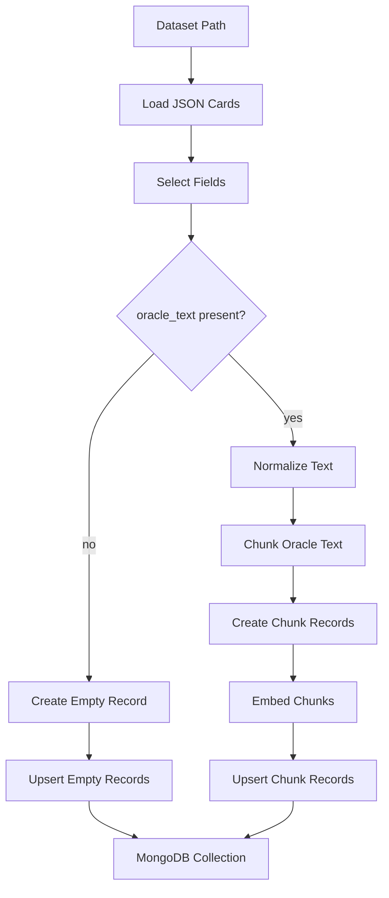
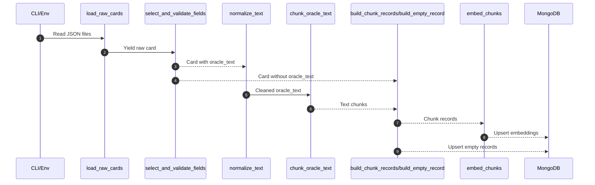

# Embeddings Pipeline Overview

This document summarizes how `scripts/create_embeddings.py` works, including key stages, data flow, and storage behavior.

## High-Level Summary
The script loads Scryfall card JSON, normalizes and chunks `oracle_text`, creates embeddings using a local SentenceTransformer model, and upserts the resulting records into MongoDB. Cards missing `oracle_text` are still stored as metadata-only records (no embedding) so the dataset remains complete.

## Architecture Diagram

## Detailed Flow

## Key Functions

- `load_raw_cards()`
  - Reads JSON files from the dataset path and yields card dicts.
- `select_and_validate_fields()`
  - Extracts `oracle_text`, `prices.usd`, `cmc`, `mana_cost`, `set_name`, and identifiers.
  - Treats missing or blank `oracle_text` as `None` (no longer skipped).
- `normalize_text()`
  - Collapses whitespace, preserves MTG symbols.
- `chunk_oracle_text()`
  - Splits `oracle_text` using the model tokenizer into overlapping token windows.
- `build_chunk_records()`
  - Builds per-chunk MongoDB docs with `has_oracle_text=true`.
- `build_empty_record()`
  - Creates metadata-only docs for cards with `oracle_text=None`.
- `embed_chunks()`
  - Generates embeddings in batches and attaches metadata.
- `upsert_embeddings()`
  - Bulk upserts into MongoDB by `_id`.

## Storage Behavior

- Chunk documents use `_id` pattern: `${card_id}:${chunk_index}`
- Empty records use `_id` pattern: `${card_id}:-1`
- `has_oracle_text` indicates whether the card produced embeddings.
- Empty records store `embedding=null`, `embedding_dim=0`.

## Operational Notes

- Uses `.env` for configuration (`MONGODB_URI`, model path, chunk sizes).
- If GPU is available, uses `cuda`; otherwise falls back to CPU.
- Logs batch progress and totals to stdout.
